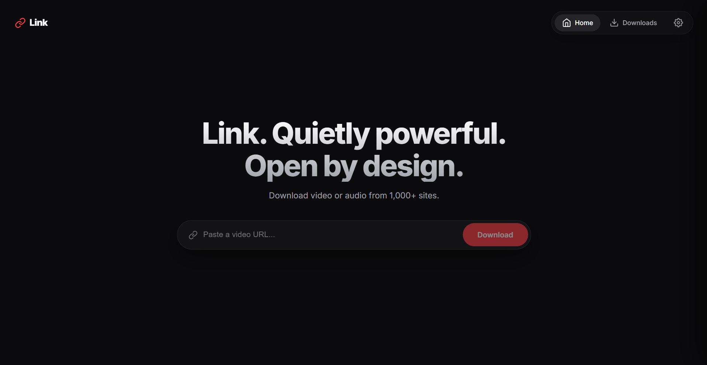
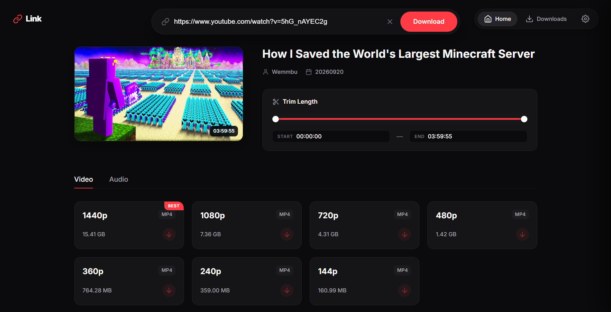
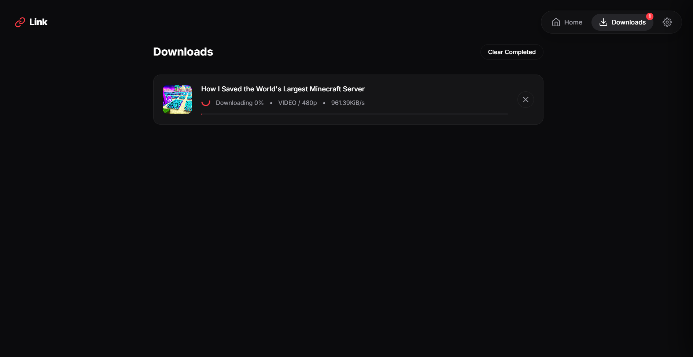

<p align="center"></p>

<h1 align="center">Link</h1>

<p align="center">Download video and audio without the command line.</p>

<p align="center"><a href="https://github.com/Amr7ky/Link/releases/latest">Download for Windows</a> · <a href="#build-from-source">Build from source</a></p>

Link is a Windows desktop interface for [yt-dlp](https://github.com/yt-dlp/yt-dlp). Paste a media link, preview the available formats, choose a quality or audio option, and download. Link uses [FFmpeg](https://ffmpeg.org/) when a download needs merging, trimming, or conversion.

## Features

- Preview the title, thumbnail, duration, and available qualities before downloading.
- Save video as MP4 and audio as MP3. Link converts a video to MP4 when the selected source format requires it.
- Trim a video or audio download by choosing start and end times.
- Follow download progress, cancel or retry a job, and open the download folder from the app.
- Choose a download folder and view the installed locations of yt-dlp, FFmpeg, and the JavaScript runtime in Settings.
- Install or update the tools you need from within the app. YouTube extraction may require Deno or a compatible system JavaScript runtime.

Site and format availability depend on yt-dlp and on the media source.

## Screenshots

**Home**



**Choose a format and trim length**



**Follow a download**



## Download

Open the [latest release](https://github.com/Amr7ky/Link/releases/latest) and choose one of the Windows x64 files:

| File | Use it when |
| --- | --- |
| `Link-Setup-1.0.1-x64.exe` | You want a normal Windows installation. |
| `Link-Portable-1.0.1.exe` | You want to run the app without an installer. |

The Windows builds are currently unsigned, so Windows may ask you to confirm that you want to run them.

### First use

1. Open Link and paste a video or audio URL.
2. If prompted, install yt-dlp and any additional tool the selected download needs.
3. Choose a video quality or audio option. Adjust the trim range if you want a shorter file.
4. Start the download and follow its progress on the Downloads page.

Use Link only for media you have permission to save.

## Build from source

On Windows, install Node.js, Rust, and the [Tauri 2 Windows prerequisites](https://v2.tauri.app/start/prerequisites/). In the project folder, run:

```powershell
npm ci
npm run tauri dev
```

To build a release:

```powershell
npm run tauri build
```

The app executable is written to `src-tauri/target/release/link.exe`; the Windows installer is under `src-tauri/target/release/bundle/`. The frontend uses HTML, CSS, and JavaScript with Vite. The desktop backend uses Rust and Tauri 2.

## Dependencies

When you choose to install a tool, Link downloads yt-dlp from its GitHub release, FFmpeg from the [BtbN FFmpeg Builds](https://github.com/BtbN/FFmpeg-Builds) release, and Deno from its official release. Managed downloads are checked against the SHA-256 checksum published with the corresponding release and stored in Link's local app data directory. These tools and other dependencies retain their own licenses.

## License

Link is licensed under the [MIT License](LICENSE). Copyright (c) 2026 Link contributors.

